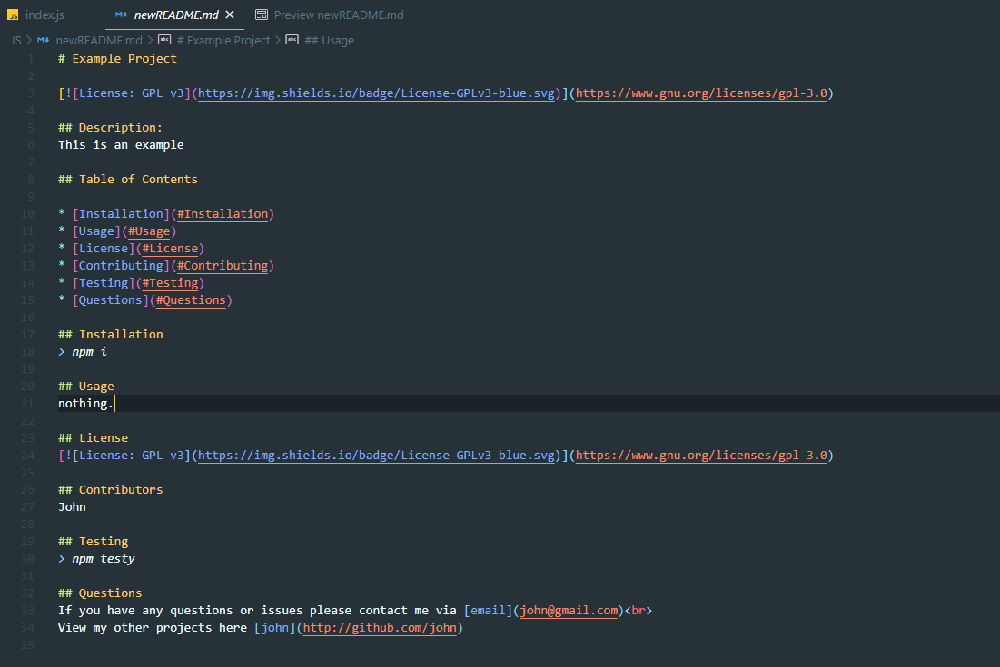
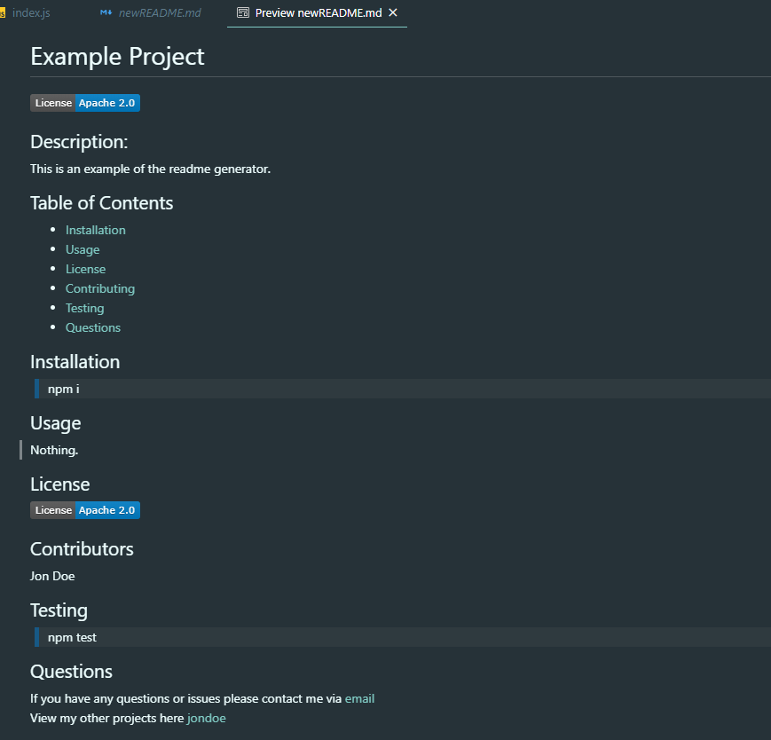

# README Generator

## Image Preview

## Description:
This application generates a clean, professional-looking README that is ready to used in seconds. Users simply follow the question prompts in node and input their specific project information. Once all questions are answered, a new README filed is generated each time. 

## Table of Contents

* [Installation](#Installation)
* [Usage](#Usage)
* [License](#License)
* [Contributing](#Contributing)
* [Testing](#Testing)
* [Questions](#Questions)

## Installation
> npm install
  
## Usage
This application can be used to generate an organized template for any project. 

## License

## Contributors
dawisen

## Testing
> npm test
  
## Questions
If you have any questions or issues please contact me via email: (daniellewwise@gmail.com)  
View my other projects [here](http://github.com/dawisen)

## Video demonstrating functionality
[Watch on Youtube](https://youtu.be/ycgEvutxFp0)
